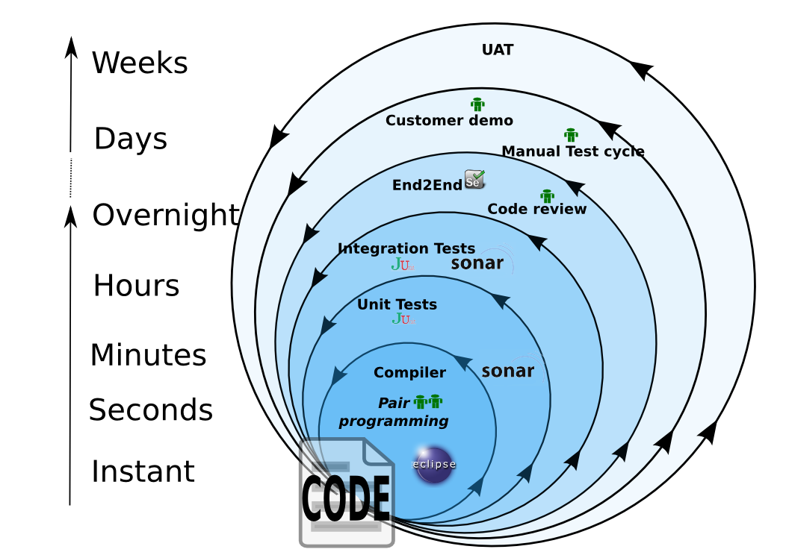

## Construire des Cycles de Retours Rapides

Le bon code est lié à un bon et rapide retour. Le plus tôt vous trouvez que quelque ne tourne pas rond plus facile sera sa correction.

Travailler sur un projet hérité, où le seul moyen de découvrir si les modifiations du code sont correctes est de le déployer sur un environnement de dev/test/recette, est frustrant et démoralisant.

Vérifier que votre projet est bien architecturé - l'effort nécessaire à cette mise en place sera payantes plusieurs fois par la suite.

Idéalement tout retour devrait être instantané, mais en pratique il est soit difficile soit impossible d'obtenir tous les retours de cette façon.

Le développement logiciel est plutôt organisé avec des niveaux imbriqués, comme indiqué là :

