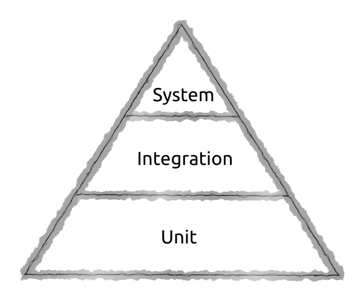
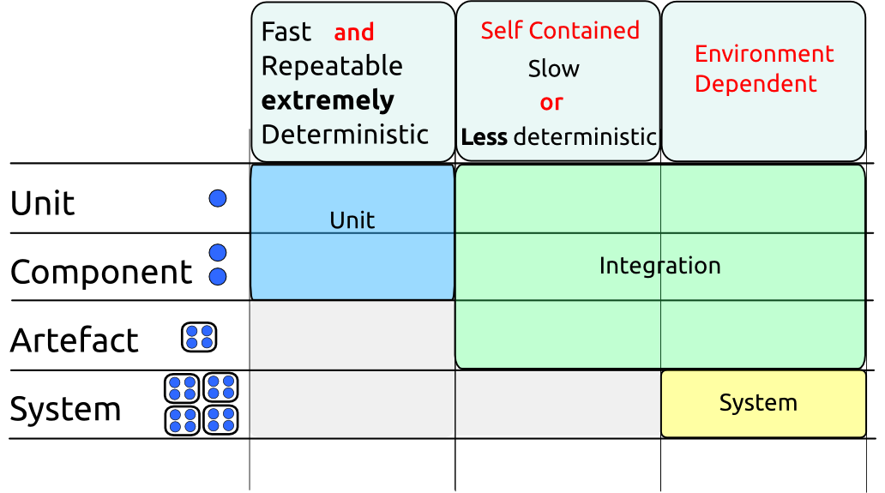
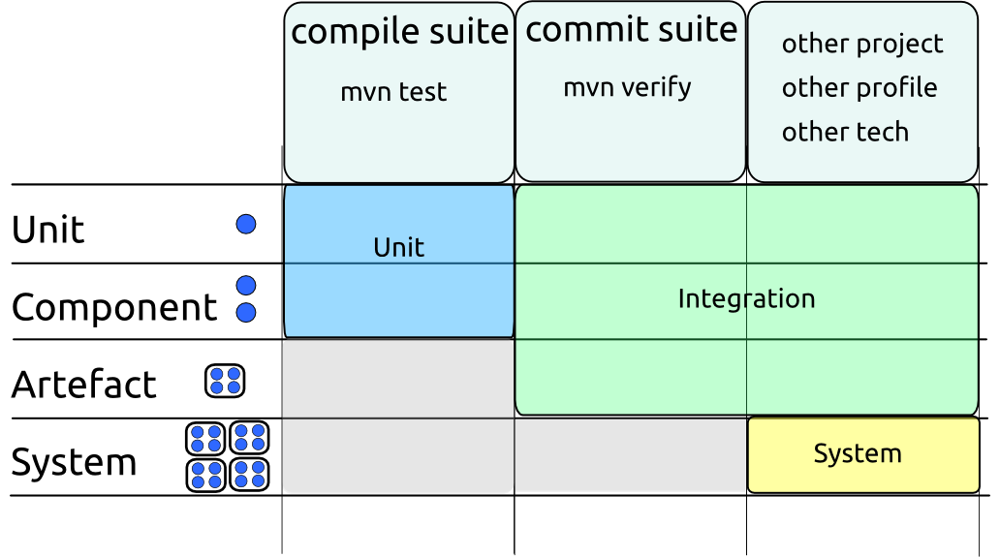

## Convenir du Langage que vous Utilisez pour les Lests

### La Pyramide des Tests

Malheureusement, le langage utilisé pour les tests est surchargé, avec différentes communités se référant a des choses différentes utilisant les mêmes noms.

La pyramide des tests est un diagramme largement reconnu de la façon dont les tests doivent être abordés.

Il montre un grand nombre de tests unitaires en bas, avec un plus petit nombre de tests unitaires au dessu et encore un plus petit nombre de tests système à sa pointe. Souvent, des nuages de tests manuels sont ajoutés au sommet.

Ce diagramme a sans doute été dessiné des milliers de fois. Bien que les tests unitaires apparaissent à la base de caque version, le vocabulaire aux autres niveaux peut varier considérament.

Bien que les mêmes mots soit utilisés leur sens peut différer.

Bien que les gens peuvent aquiescer quand vous discutez "tests unitaires", "tests d'intégration", "tests système", "tests de bout à bout", "tests de service", il n'y a pas de garantie qu'ils pensent la même chose que vous.

En fonction de votre interlocuteur, un "test unitaire" peut être n'importe quoi depuis un document word pleine d'instructions, "tout test écrit par un développeur", via diverses définitions formelles (mais en aucun cas faisant autorité) qui apparaissent dans les livres.

Le nombre de sens possibles pour "tests d'intégration" est encore plus grand.

### Les Tests Unitaires

Une définition assez complète d'un test unitaire est largement utilisé dans la communité Java. Nous préconisons que vous et votre équipe utilise cette définition.

Pour être un test unitaire, un test doit être :

* Rapide (millisecondes ou moins)
* Isolé (ne tester qu'une chose)
* Répétable (capable d'être exécuté des millions de fois sur toute machine avec le même résultat)
* Auto vérifiant (ça passe ou àa échoue)
* En temps et en heure (écrit en premier)

Note: Bien qu'écrire vos test en premier est souvent ujne bonn idée, un test qui vérifie les autres critères est quand même un test unitaire indépendamment de quand il a été écrit.

Quand nous parlons de tests "unitaires", qu'est-ce que signifie *unitaire* n'est pas forcément évident.

Une définition quelque peu récursive est que *unitaire* se réfère à la plus petite chose que l'on peut tester de façon indépendante.

Ce sera souvent une seule classe , mais ce peut n'est pas toujours le cas. Celà a du sens de traiter un groupe de classes comme une unité (surtout si la plupart ne sont pas publiques) ou occasionnellement même une seule méthode. 

Si nous acceptons qu'une *unité* est une petit chose, et que nous le saurons quan,d nous la verrons, alors nous pouvons voir que le critère pour être un test unitaire correspond le critère que nous avons mis en avant pour le jeu de compilation.

La seule différence est que le jeu de compilation ne se soucie pas de l'isolation.

Si nous choisissons d'écrire une test qui teste deux (ou plus) *unités* en tandem, il appartient encore au jeu de compilation s'il vérifie les autres critères.

### Tests Systèmes

Les tests systèmes sont aussi assez bien définis. Ce sont des tests qui s'exécutent dans un système complet - càd tout votre code et tout le code qui intéragit avec un environnement réaliste.

### Tests d'Integration 

Les tests d'intégration sont plus difficiles à définir. Ils regroupent tout ce qui ne peut être mis dans la définition des tests unitaires et tests systèmes.

Les deux diagrammes suivants montrent comment la terminologie s'inscrit dans notre monde de jeux de tests.

Ce document utilisera la terminology de *test unitaire", *test d'intégratino* et "test système" comme vu dans ces diagrammes.

Pour clarifier, il dira parfois exactement ce qui est testé lors des tests d'intégration - comme "test via l'API REST du war démarré dans Tomcat". 

Bien qu'elle soit fastidieuse, cette terminologie est claire. Il est recommendé que vous l'utilisiez quand vous discutez de tests parmi votre équipe. Au sein de votre équipe il est probable que vous développiez un langage plus court que tous comprendront.

A mettre en corrélation avec nos jeux de tests montrés ici:

